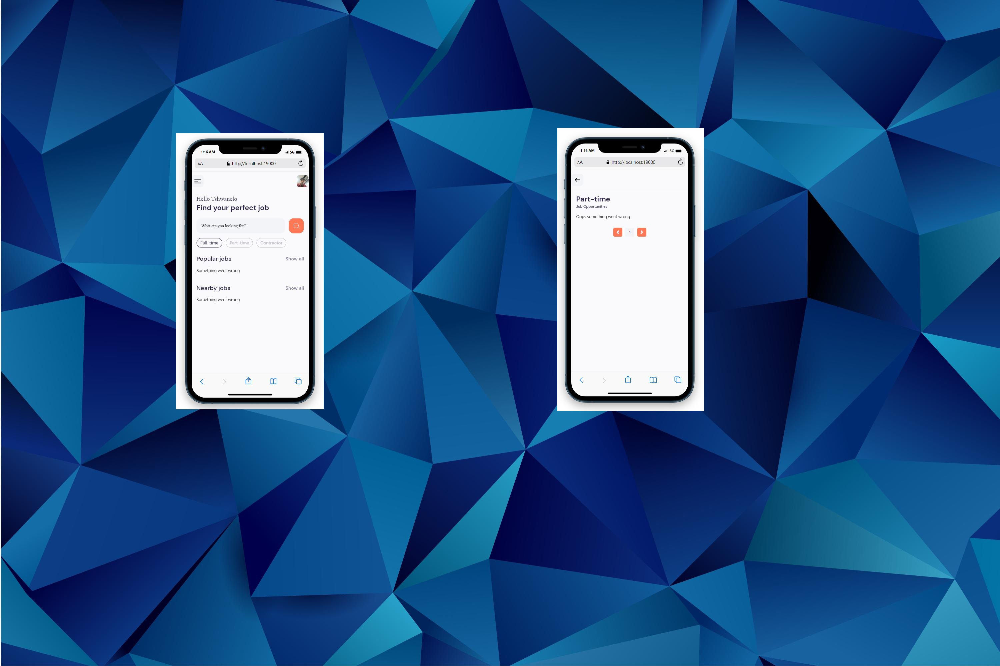

# MERN Authentication Starter

This is a frontend React Native application to search jobs and view jobs from Rapid-API api. it has three screens home screen, search jobs screen and view job detail screen. It utilises react native expo for crossplatform application.    



It includes the following:

- React Native frontend to view jobs and search jobs
- Dynamic routing
- Expo router

## Usage

- Create Rapid AI account and get your jsearch key  `RAPID_API_KEY` - (https://rapidapi.com/letscrape-6bRBa3QguO5/api/jsearch/)

### Env Variables

Rename the `.env-example` file to `.env` and add the following

```
RAPID_API_KEY = your jobsearch api key from 
```

### Install Dependencies (frontend & backend)

```
npm install

```

### Run

```
# Run frontend (:3000)

android: npm run android
ios: npm run ios
web: npm run web
```